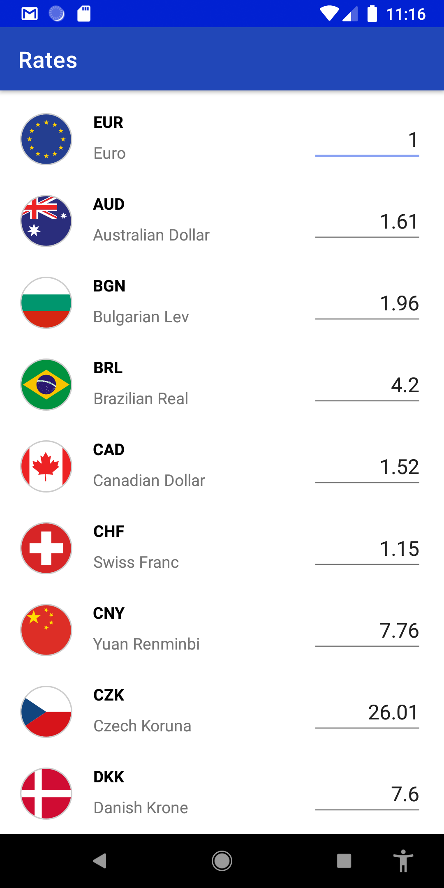
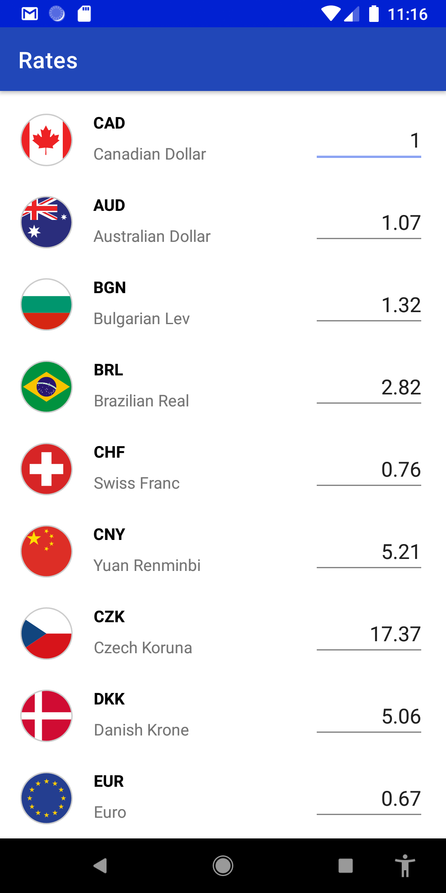
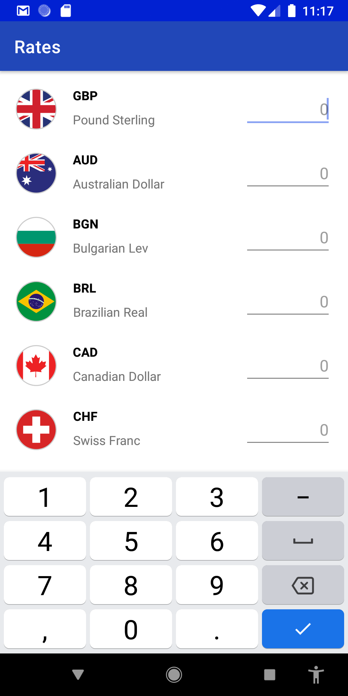
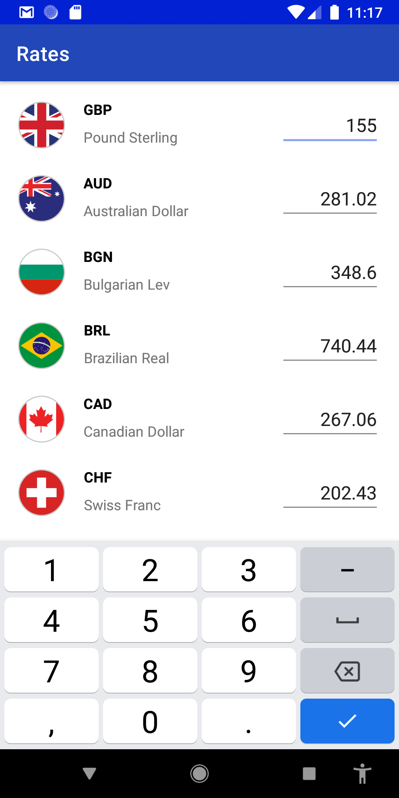

# Currency Convert Android Application
## This project was coded with Kotlin, MVVM (Model–view–viewmodel) architectural and Hilt (Dependency injection) 
---
The App will call the end point very second to get the latest rates, process the response by transforming it into a List and then update the adapter. 

---	
## Screenshots
|  |  |  | 
|:---:|:---:|:---:|:---:|
| On App Loaded | On Row Clicked | Cleared input | Entered amount to convert